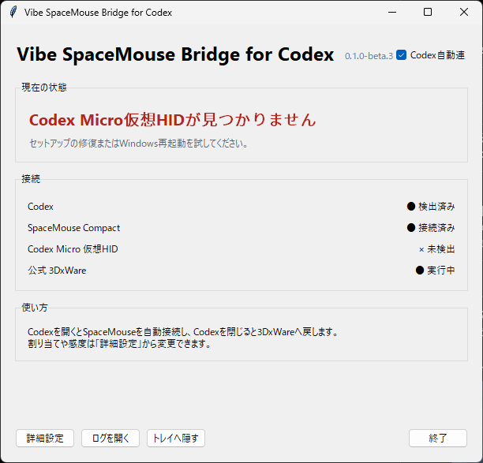
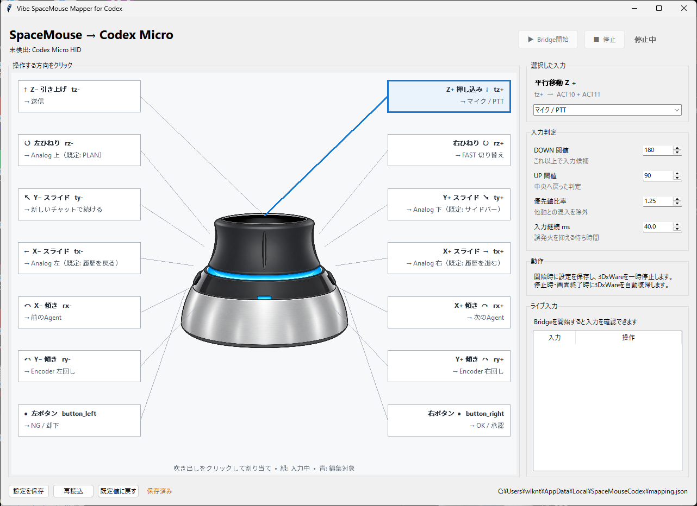

# Vibe SpaceMouse Bridge for Codex

[](https://www.microsoft.com/windows/windows-11)
[](LICENSE)
[](https://github.com/bruiselea/vibe-3dmouse/releases/tag/v0.1.0-beta.3)

手元にある3Dconnexion SpaceMouseを、Codex Micro風の入力デバイスとして使うための
Windows向けブリッジです。

このプロジェクトは、まず「手元にあるSpaceMouseでCodexを操作できないか？」という
アイデアから始まり、SpaceMouseの入力判定と操作割り当てを構想しました。その後、
GOROmanさんが公開してくださったCodex Micro互換ソフトウェア
[vibewatch](https://github.com/GOROman/vibewatch)を参考に、Codexと接続するHID互換部分を
実装しています。
SpaceMouseの押す・引く・傾ける・ひねる・左右ボタンを、Codexの音声入力、送信、
承認／却下、Agent切り替えなどへ割り当てられます。

> [!WARNING]
> `0.1.0-beta.3`はテスト署名ドライバを使う検証版です。SetupはPCのRoot／TrustedPublisherへ
> テスト証明書を登録します。内容を理解したうえで、信頼できる配布元から入手したSetupだけを
> 使用してください。一般公開用の正式署名版ではありません。

## 現在の開発状況（2026-08-28）

主要機能の実装を終え、開発者のWindows 11環境では日常利用できる段階になりました。
`main`には、トレイからの手動接続、ログイン時自動起動の設定、仮想HIDの自動復旧を反映しています。
これらの改善は既存の **beta.3インストーラには未収録** です。今回はソースのみの更新で、
新しいインストーラや正式リリースの公開は別途行います。

Pythonの自動テスト41件に加え、ローカル環境でHIDの再生成、復旧タスクの通常権限からの起動、
Bridge接続を確認しています。クリーン環境での導入・更新・削除一式の検証は今後の課題です。

## Screenshots





## 主な機能

- SpaceMouse Compactの6軸を正負12方向、左右ボタンを2入力として扱う14入力
- キーボードショートカットではなく、仮想HIDからCodexへ直接入力
- Codexの起動を検出して自動接続し、終了後は3DxWareへ自動復帰
- 誤入力を抑えるDOWN／UPヒステリシス、優先軸判定、継続時間判定
- 画像上の方向をクリックして割り当てを変更できるマッピングUI
- タスクトレイ常駐、ログイン時自動起動の自己修復、二重起動防止
- ダッシュボードまたはトレイから「今すぐ接続 / 再試行」
- 再起動後に消えた仮想HIDを管理者タスクで自動復旧し、古いゴーストを清掃
- 設定とログをLocalAppDataへ保存し、アンインストール後も割り当てを保持

## 対応環境

- Windows 11 x64（build 22000以降）
- 3Dconnexion SpaceMouse Compact（VID `256F` / PID `C635`）
- OpenAI Codex Windowsアプリ

初版は上記のSpaceMouse Compactのみを対象にしています。ARM64や他モデルは未検証です。
3DxWareが入っていない環境でもBridgeは動作します。

## インストール

1. [Releases](https://github.com/bruiselea/vibe-3dmouse/releases/tag/v0.1.0-beta.3)から
   `VibeSpaceMouseBridgeForCodex-0.1.0-beta.3-x64-setup.exe`をダウンロードします。
2. 必要に応じて同梱のSHA-256ファイルと照合します。
3. Setupを実行し、テスト証明書と仮想HIDドライバの導入に同意します。
4. Codexを起動するとSpaceMouseへ自動接続します。

通常の閉じる操作ではタスクトレイへ移動します。完全に停止する場合は、ダッシュボードまたは
トレイメニューの「終了」を選んでください。

## 既定の割り当て

| SpaceMouse入力 | Codex操作 |
|---|---|
| Xスライド 左／右 | 履歴を戻る／進む |
| Yスライド 前／後 | 新しいチャットで続ける／サイドバー |
| Z押し込み | マイク／PTT |
| Z引き上げ | 送信 |
| X傾き 左／右 | 前／次のAgent |
| Y傾き 左／右 | Encoder左／右 |
| 左ひねり／右ひねり | PLAN／FAST切り替え |
| 左ボタン／右ボタン | 却下／承認 |

判定の既定値はDOWN `180`、UP `90`、優先軸比率 `1.25`、継続時間 `40ms`です。
詳細な測定内容は [CALIBRATION.md](CALIBRATION.md) を参照してください。

## 設定とログ

- 割り当て: `%LOCALAPPDATA%\SpaceMouseCodex\mapping.json`
- 常駐設定: `%LOCALAPPDATA%\SpaceMouseCodex\settings.json`
- ログ: `%LOCALAPPDATA%\SpaceMouseCodex\logs\app.log`
- 仮想HID復旧ログ: `%PROGRAMDATA%\SpaceMouseCodex\hid-recovery.log`

アプリログは最大5MB、3世代でローテーションします。

## 開発版

Python 3.12の仮想環境を用意します。

```powershell
py -3.12 -m venv .venv
.\.venv\Scripts\python.exe -m pip install -r requirements.txt
```

SpaceMouseの生入力確認:

```powershell
.\.venv\Scripts\python.exe -m spacemouse_input list
.\.venv\Scripts\python.exe -m spacemouse_input monitor --raw
```

研究・診断用マッピングGUI:

```powershell
.\.venv\Scripts\python.exe -m spacemouse_input gui
```

配布版ダッシュボード:

```powershell
.\.venv\Scripts\python.exe -m spacemouse_input release
```

### 開発版の仮想HID自動復旧

仮想HIDドライバが導入済みの開発環境では、補助ツールをビルドして復旧タスクを登録できます。
Visual Studio 2022 Build Toolsが必要です。タスク登録時にはUAC確認が表示されます。

```powershell
powershell -NoProfile -ExecutionPolicy Bypass -File .\scripts\build_swdevice_helper.ps1
powershell -NoProfile -ExecutionPolicy Bypass -File .\scripts\install_hid_recovery_task.ps1
```

登録されるWindowsタスクは次の2つです。

- `VibeSpaceMouseBridge-EnsureVirtualHid-System`: Windows起動時にSYSTEM権限で確認
- `VibeSpaceMouseBridge-EnsureVirtualHid`: ログイン時およびアプリからの要求時に管理者権限で確認

SWDが失われた場合に再生成し、HIDが現れてからBridgeが接続します。
「今すぐ接続 / 再試行」はCodex自動連動をONにして再確認します。Codexが起動している必要があります。

> [!CAUTION]
> 開発版の復旧タスクは、この作業フォルダ内のスクリプトとEXEを高い権限で実行します。
> 信頼できるコードだけを置き、他のユーザーが書き換えられる共有フォルダでは使用しないでください。
> タスク登録後に作業フォルダを移動・削除すると復旧できなくなります。
> 一般ユーザー向けの安全な配布・権限設計は、正式公開前に追加確認が必要です。

開発版タスクを解除する場合は、管理者PowerShellで以下を実行します。
割り当て設定や導入済みドライバは削除しません。

```powershell
Unregister-ScheduledTask -TaskName 'VibeSpaceMouseBridge-EnsureVirtualHid' -Confirm:$false
Unregister-ScheduledTask -TaskName 'VibeSpaceMouseBridge-EnsureVirtualHid-System' -Confirm:$false
```

## ビルド

Releaseドライバ、PyInstaller onedir、Inno Setup、SHA-256生成までを一括実行します。
Visual Studio 2022 Build Tools、Windows Driver Kit、Inno Setup 6が必要です。

```powershell
powershell -ExecutionPolicy Bypass -File .\scripts\build_release.ps1
```

成果物は `dist\installer` に生成されます。

テスト:

```powershell
.\.venv\Scripts\python.exe -m unittest discover -s tests -v
```

## 仕組み

SpaceMouseの物理HIDレポートを読み、Codex Micro互換の仮想HID
（VID `303A` / PID `8360`）へ変換します。仮想デバイスはMicrosoft Virtual HID miniport sampleを
基にしたUMDFドライバとSWDで提供します。Bridge動作中のみ3DxWareを一時停止し、終了時や
Codex未検出時には復帰処理を行います。

## 謝辞と商標

- [GOROman/vibewatch](https://github.com/GOROman/vibewatch) — 後から公開されたCodex Micro互換HID実装の参考
- [OpenAI × Work Louder: Codex Micro](https://openai.com/ja-JP/supply/co-lab/work-louder/) — プロジェクトの着想
- Microsoft Virtual HID miniport sample — 仮想HID実装の基礎

SpaceMouseおよび3Dconnexionは3Dconnexionの商標または登録商標です。CodexおよびOpenAIは
OpenAIの商標または登録商標です。本ソフトは独立したコミュニティプロジェクトであり、OpenAI、
3Dconnexion、GOROmanさんとの提携、承認、後援を示すものではありません。第三者のロゴは同梱していません。

## License

本プロジェクトの独自コードは [MIT License](LICENSE) で公開します。
Microsoftサンプル由来コードおよび第三者コンポーネントには、それぞれのライセンスが適用されます。
詳細は [THIRD_PARTY_NOTICES.txt](THIRD_PARTY_NOTICES.txt) と
[THIRD_PARTY_LICENSES](THIRD_PARTY_LICENSES) を参照してください。
